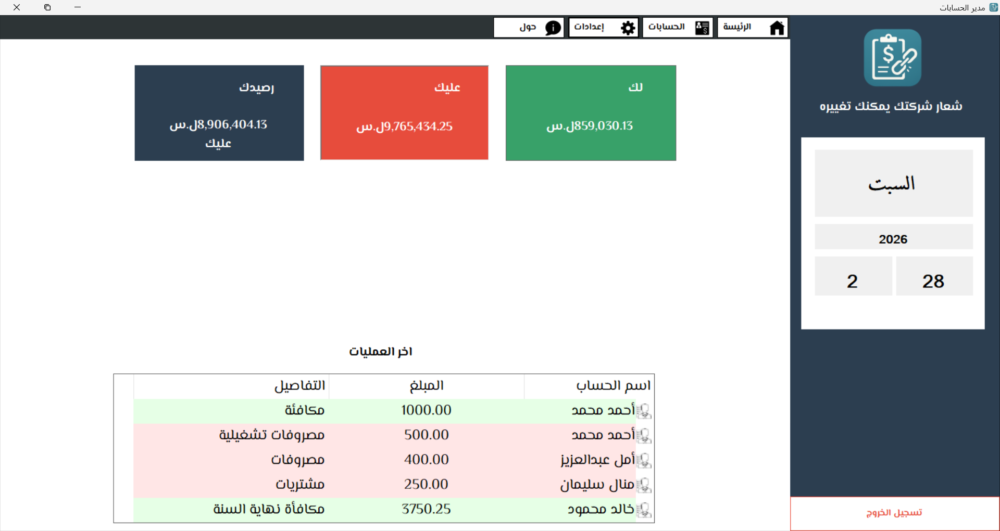
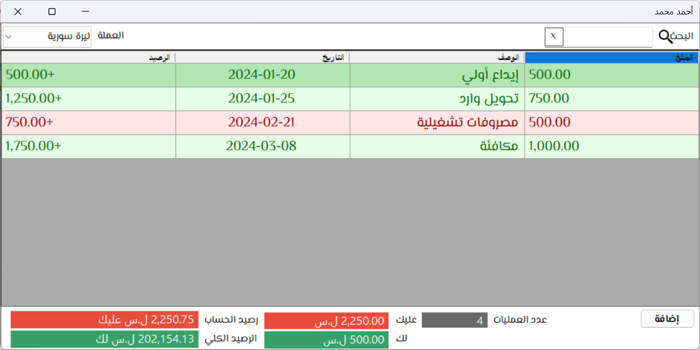
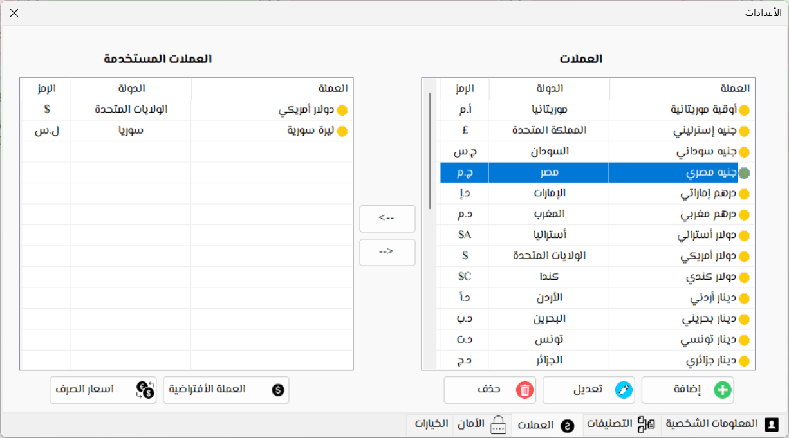

# 📊 مدير الديون - تطبيق تتبع الديون الشخصية والتجارية

  

  <strong>📱 تطبيق عربي بالكامل - Fully Arabic Interface</strong>

مدير الديون هو تطبيق سطح مكتب بسيط لكنه قوي، مصمم لإدارة الحسابات الشخصية والتجارية دون الحاجة إلى أي خلفية محاسبية. يتيح لك تتبع المعاملات المالية مع العملاء، الموردين، الأصدقاء، أو أي شخص آخر، مع دعم كامل للعملات المتعددة وتقارير مفصلة.

**واجهة التطبيق بالكامل باللغة العربية**، مما يجعله متاحاً بالكامل للمتحدثين بالعربية.

---

## ✨ المميزات الأساسية

- **إدارة حسابات متعددة**  
  إنشاء حسابات للأشخاص، الشركات، الموردين وتنظيمها في فئات.

- **دعم العملات المتعددة 💱**  
  إنشاء عدة حسابات لنفس الشخص بعملات مختلفة، تعيين أسعار الصرف، وعرض الأرصدة حسب العملة.

- **تسجيل المعاملات**  
  إضافة معاملات (دائن/مدين) بسهولة مع تحديث الرصيد بشكل فوري.

- **تصنيف ذكي**  
  تنظيم الحسابات في مجموعات مثل عملاء، موردين، شركات للوصول السريع.

- **بحث وتصفية متقدم**  
  البحث عن أي حساب أو معاملة؛ وتصفية النتائج لعرض المعاملات الدائنة أو المدينة فقط.

- **واجهة مستخدم قابلة للتخصيص**  
  التبديل بين عرض الجدول، الأيقونات الكبيرة، أو الأيقونات الصغيرة؛ إضافة صورة ملفك الشخصي وشعار الشركة.

- **النسخ الاحتياطي والاستعادة 🔒**  
  نظام نسخ احتياطي مدمج لحماية بياناتك واستعادتها بسهولة.

- **يعمل بدون إنترنت**  
  يعمل محلياً بالكامل على جهازك، مما يضمن خصوصية وأمان بياناتك.

- **تقنية موثوقة**  
  تم بناؤه باستخدام C# (Windows Forms) و SQL Server لأداء عالٍ واستقرار.

---

## 🖥️ لقطات الشاشة

  <h3>النافذة الرئيسية</h3>
  
  
<em>لوحة التحكم الرئيسية</em>

  <h3>إضافة معاملة</h3>
  
  
  
<em>إضافة معاملات جديدة وعرض سجل المعاملات</em>

  <h3>إدارة العملات</h3>
  
  
<em>إدارة العملات المتعددة وأسعار الصرف</em>

> 📌 جميع لقطات الشاشة مخزنة في مجلد [`Screenshots`](./Screenshots) الخاص بالمشروع.

---

## 🎥 شاهد الفيديو

شاهد العرض التوضيحي الكامل لتطبيق مدير الديون على اليوتيوب:

*اضغط على الصورة لمشاهدة الفيديو*

---

## 📋 متطلبات النظام

- **نظام التشغيل:** ويندوز 7 / 8 / 10 / 11 (64 بت أو 32 بت)
- **الإطار البرمجي:** .NET Framework 4.7.2 أو أحدث
- **قاعدة البيانات:** Microsoft SQL Server (Express, LocalDB, أو أي إصدار)
  *يوصى باستخدام SQL Server Express LocalDB (يمكن تثبيته مع Visual Studio أو بشكل منفصل)*
- **الذاكرة العشوائية:** 2 جيجابايت كحد أدنى
- **مساحة التخزين:** 100 ميجابايت للتطبيق + مساحة قاعدة البيانات

---

## 🚀 كيفية الاستخدام

1. **إضافة العملات:** اذهب إلى **الإعدادات ← العملات**، أضف العملات التي تتعامل بها (مثل دولار، يورو، جنيه) وحدد أسعار صرفها مقابل العملة الأساسية.
2. **إنشاء حساب جديد:** في الشاشة الرئيسية، انقر **"إضافة حساب"**، اختر الفئة، أدخل الاسم ورقم الهاتف.
3. **تسجيل معاملة:** اختر حساباً، ثم انقر **"معاملة جديدة"**. أدخل المبلغ، النوع (دائن أو مدين)، ووصفاً.
4. **النسخ الاحتياطي:** اذهب إلى **الإعدادات ← الخصائص** لحفظ نسخة من قاعدة البيانات في مكان آمن.

---

## 🤝 المساهمة

المساهمات مرحب بها! إذا كنت ترغب في تحسين التطبيق أو إضافة ميزة جديدة:

1. قم بعمل Fork للمستودع.
2. أنشئ فرعاً للميزة (`git checkout -b feature/AmazingFeature`).
3. قم بعمل Commit للتغييرات (`git commit -m 'إضافة ميزة رائعة'`).
4. ادفع إلى الفرع (`git push origin feature/AmazingFeature`).
5. افتح Pull Request.

يرجى التأكد من تحديث الاختبارات حسب المناسب.

---

## 📜 الرخصة

هذا المشروع مرخص تحت رخصة MIT – راجع ملف [LICENSE](LICENSE) للتفاصيل.

---

## 📞 الاتصال

- **البريد الإلكتروني:** abdulrahmanalkhuraki@gmail.com
- إذا واجهت أي مشكلة، يرجى فتح [تذكرة](https://github.com/alkhuraki963/Debts-Manager/issues) في هذا المستودع.

---

## ⚠️ ملاحظة

هذا البرنامج مقدم "كما هو" بدون أي ضمان. المؤلف غير مسؤول عن أي خسائر مالية ناتجة عن سوء الاستخدام. احتفظ دائماً بنسخ احتياطية منتظمة.

---

 اترك نجمة ⭐ إذا أعجبك هذا المشروع 
